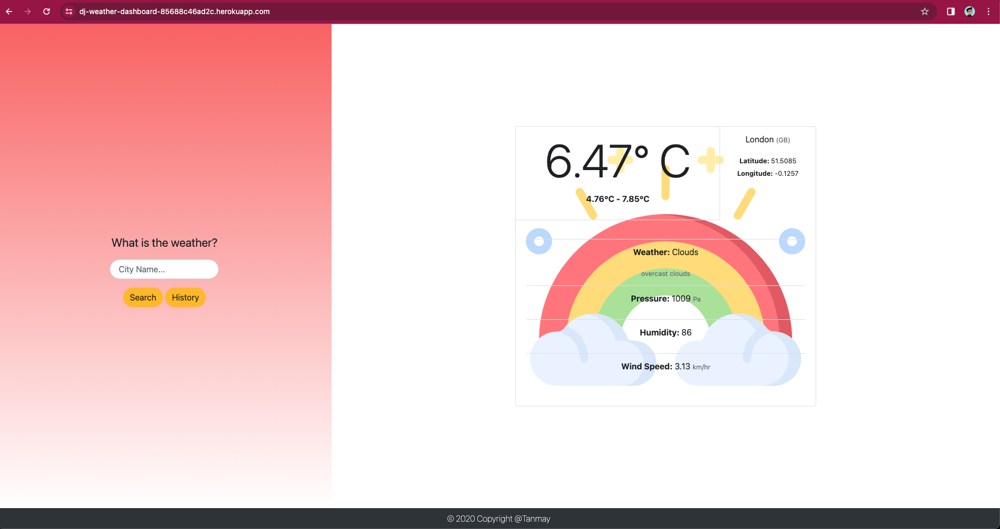
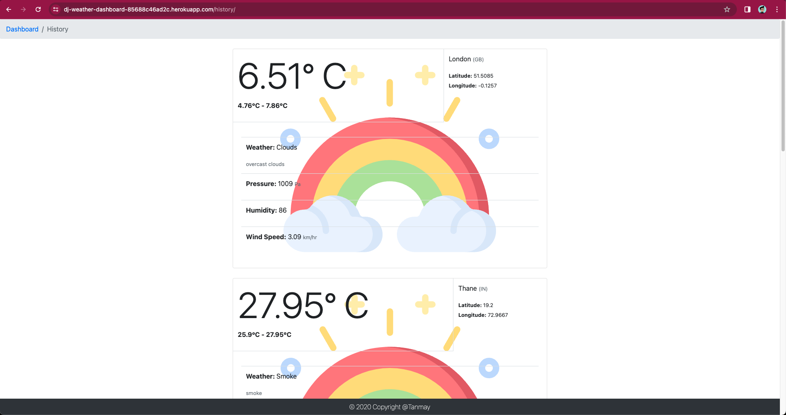

## Django Weather Dashboard🌈

A Weather Application built using Django and OpenWeatherMap API and hosted on Heroku

Live on https://dj-weather-dashboard-85688c46ad2c.herokuapp.com/

## Screenshots

`/`

`/history`

